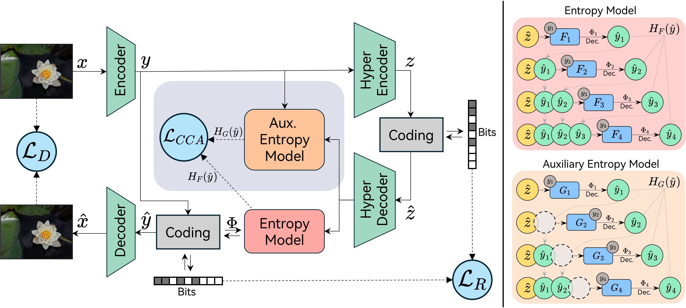
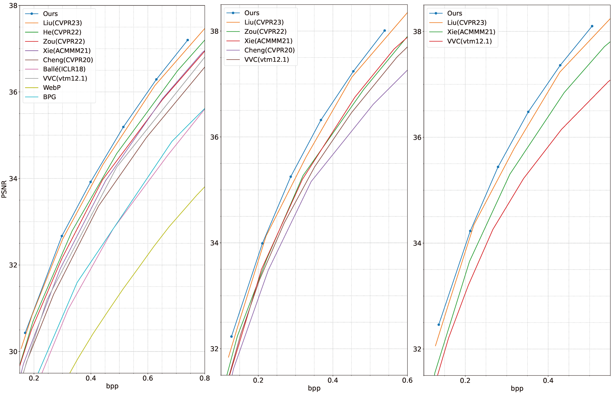

# Causal Context Adjustment Loss for Learned Image Compression

[](https://arxiv.org/abs/2410.04847)




This repository is the Pytorch implementation of the paper "[Causal Context Adjustment Loss for Learned Image Compression](https://arxiv.org/abs/2410.04847)" (NeurIPS 2024):

## Setup

### Installation

Clone this repository:

```bash
git clone https://github.com/LabShuHangGU/CCA.git
```

Install [CompressAI](https://github.com/InterDigitalInc/CompressAI) and required packages:

```bash
pip install compressai tensorboard
```

### Datasets

Download [OpenImages](https://github.com/openimages) for training ; [Kodak](https://r0k.us/graphics/kodak/), [CLIC](https://www.compression.cc/) and [TESTIMAGES](https://testimages.org/) for evaluation.

## Usage

### Training

A training script for reference is provided in `train.py`.

```bash
CUDA_VISIBLE_DEVICES='0' python -u ./train.py -d [path of training dataset] \
    -lr 1e-4 --cuda --beta 0.3 --epochs 65 --lr_epoch 56 --batch-size 8 \
    --save_path [path for storing the checkpoints] --save \
    --checkpoint [path of the pretrained checkpoint]
```

The script supports distributed training as well:

```bash
CUDA_VISIBLE_DEVICES='0, 1' python -m torch.distributed.launch --nproc_per_node=[the number of nodes] \
	--master_port=29506 ./train.py -d [path of training dataset] \
    -lr 1e-4 --cuda --beta 0.3 --epochs 65 --lr_epoch 56 --batch-size 8 \
    --save_path [path for storing the checkpoints] --save \
    --checkpoint [path of the pretrained checkpoint]
```

### Evaluation

```bash
CUDA_VISIBLE_DEVICES='0' python eval.py --checkpoint [path of the pretrained checkpoint] --data [path of test dataset] --cuda
```

### Pretrained Models

Note that we train $\lambda$ = {0.3, 0.85, 1.8, 3.5} models with $\lambda$ = 0.3 at the beginning, and adapt them using target
$\lambda$ values after decaying the learning-rate; while $\lambda$ = {7, 15} with $\lambda$ = 2 at the beginning. This training strategy helps our proposed CCA-loss adjust the contextual information.

> ⚠️ `beta` in the code corresponds to `lambda` in the paper.

| Lambda (Link) | [0.3](https://drive.google.com/file/d/1gAUvZKKzlh0Tuo22kTMIxNmUZlXogpRO/view?usp=drive_link) | [0.85](https://drive.google.com/file/d/1K3veWSXFtANS71LY-ksiMXiNjIqL_mL1/view?usp=drive_link) | [1.8](https://drive.google.com/file/d/17KRA3NYxuNyszhIIR9HGC0ODPx9HcDyB/view?usp=sharing) | [3.5](https://drive.google.com/file/d/1gION784PtjcxAzIgdb-eSjhuZkeG9z_l/view?usp=sharing) |
| ------------- | ------------------------------------------------------------ | ------------------------------------------------------------ | ------------------------------------------------------------ | ------------------------------------------------------------ |

Other pretrained models will be released successively.

## Results

### Visualization


### RD curves



> Left: Kodak | Middle: CLIC | Right: TESTIMAGES
>
> For detailed rate-distortion datas, please refer to `RD_data.json`.

## Citation

```
@article{han2024causal,
  title={Causal Context Adjustment Loss for Learned Image Compression},
  author={Han, Minghao and Jiang, Shiyin and Li, Shengxi and Deng, Xin and Xu, Mai and Zhu, Ce and Gu, Shuhang},
  journal={arXiv preprint arXiv:2410.04847},
  year={2024}
}
```

## Related Repositories

https://github.com/jmliu206/LIC_TCM

https://github.com/megvii-research/NAFNet

https://github.com/InterDigitalInc/CompressAI

## Contact

If you have any questions, feel free to contact me through email ([minghao.hmh@gmail.com](mailto:minghao.hmh@gmail.com)).
